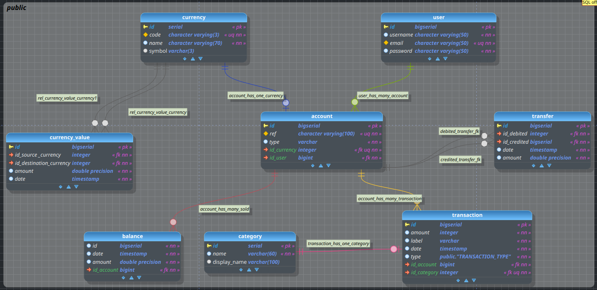

# TD: WALLET
This repository contains the exercise about the 
Wallet budget web app
## Petstore swagger UI link
Here is the link of the UI's api: [petstore swagger UI](https://petstore.swagger.io/?url=https://raw.githubusercontent.com/TD-wallet/TD-wallet/td-wallet-std22049-std22081/docs/api.yaml)

## Database Schema
